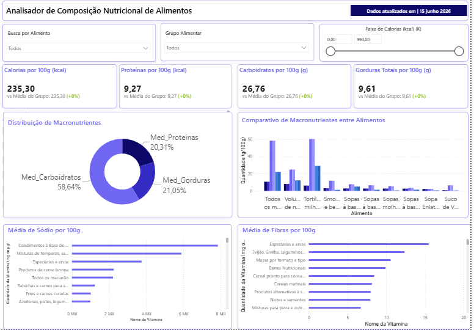
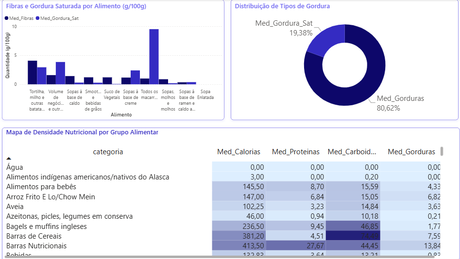
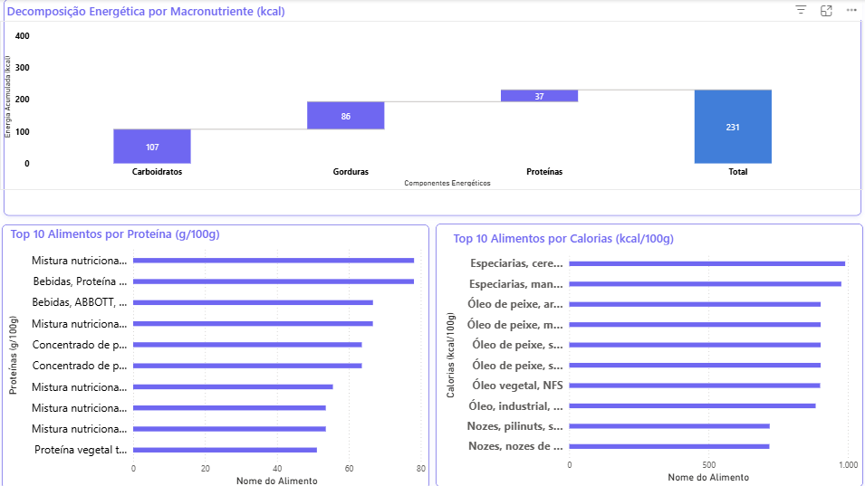

# 🥗 Nutri Insights — Análise de Composição Nutricional de Alimentos


## 📌 Sobre o Projeto

O **NutriInsights** é um projeto de dados end-to-end desenvolvido com foco em saúde e nutrição. O objetivo é coletar, armazenar, tratar e visualizar dados nutricionais de alimentos, além de disponibilizar um agente de IA capaz de responder perguntas sobre os dados em linguagem natural.

> Projeto desenvolvido como portfólio para a área de Dados e IA, com aplicação direta no contexto de saúde, prevenção e bem-estar.

---

## 🎯 Perguntas de Negócio Respondidas

- Quais categorias de alimentos têm maior teor médio de calorias?
- Como o sódio varia entre os grupos alimentares?
- Quais são os 10 alimentos com maior índice proteico?
- Qual é a decomposição energética média por macronutriente?
- Quais grupos alimentares possuem melhor densidade nutricional?

---

## 🏗️ Arquitetura do Projeto

API USDA FoodData Central

↓

ingest.py (coleta e extração)

↓

MySQL (armazenamento)

↓

clean.py (limpeza, tradução e exportação)

↓

CSV Processado → Power BI (visualização)

↓

ai_agent.py (Text-to-SQL com Groq)

---

## 📁 Estrutura de Pastas

nutrinsights/

├── data/

│   ├── raw/               # JSON bruto coletado da API

│   └── processed/         # CSV limpo e traduzido para o Power BI

├── src/

│   ├── ingest.py          # Coleta de dados da API USDA

│   ├── load_db.py         # Inserção dos dados no MySQL

│   ├── populate_db.py     # População do banco com múltiplas categorias

│   ├── clean.py           # Limpeza, tradução e exportação dos dados

│   └── ai_agent.py        # Agente de IA Text-to-SQL com Groq

├── sql/

│   ├── schema.sql         # Estrutura do banco de dados

│   └── queries.sql        # Queries analíticas comentadas

├── dashboard/

│   └── nutriinsights.pbix # Dashboard Power BI (3 páginas)

├── .env.example           # Modelo de variáveis de ambiente

├── requirements.txt       # Dependências do projeto

└── README.md

---

## 🛠️ Tecnologias Utilizadas

| Tecnologia | Função |
|---|---|
| Python 3.14 | Linguagem principal |
| Requests | Consumo da API USDA |
| MySQL | Armazenamento dos dados |
| Pandas | Limpeza e transformação |
| SQLAlchemy | Conexão Python → MySQL |
| Deep Translator | Tradução automático EN → PT |
| Groq (LLaMA 3.1) | Agente de IA Text-to-SQL |
| PyMySQL | Execução segura de queries |
| Power BI | Visualização e dashboard |
| Python Dotenv | Gerenciamento de credenciais |

---

## 📊 Dashboard Power BI

O dashboard foi dividido em 3 páginas:

**Página 1 — Analisador Nutricional**


Visão geral com KPIs interativos, filtros por grupo alimentar e faixa de calorias, distribuição de macronutrientes e comparativo entre alimentos.

**Página 2 — Análise Energética e Rankings**


Decomposição energética por macronutriente (kcal) e ranking dos Top 10 alimentos por proteína e por calorias.

**Página 3 — Densidade Nutricional**


Mapa de densidade nutricional por grupo alimentar, perfil de fibras e gorduras saturadas, e distribuição de tipos de gordura.

---

## 🤖 Agente de IA Text-to-SQL

O projeto inclui um agente de IA que converte perguntas em português para queries SQL e retorna respostas em linguagem natural.

**Exemplo:**
Pergunta: Quais são os 10 alimentos mais calóricos?

SQL gerado:
SELECT nome, calorias_100g FROM alimentos
ORDER BY calorias_100g DESC LIMIT 10;

Resposta:
Os alimentos mais calóricos são especiarias e óleos vegetais,
com destaque para óleos de peixe que chegam a 900 kcal/100g...

**Segurança em duas camadas:**
- Camada da IA: bloqueio de operações de escrita e perguntas fora do contexto
- Camada do banco: usuário com permissão apenas de SELECT

---

## 🚀 Como Executar o Projeto

### Pré-requisitos
- Python 3.10+
- MySQL 8.0+
- Power BI Desktop

### Instalação

```bash
# Clone o repositório
git clone https://github.com/CauaCristalino/nutri_insights.git
cd nutri_insights

# Crie e ative o ambiente virtual
python -m venv venv
source venv/Scripts/activate  # Windows
source venv/bin/activate      # Mac/Linux

# Instale as dependências
pip install -r requirements.txt
```

### Configuração

Crie um arquivo `.env` igual ao arquivo `.env.example` com esses dados e altere com as suas chaves:

DB_HOST=localhost
DB_PORT=3306
DB_USER=root
DB_PASSWORD=sua_senha
DB_NAME=nutri_insights
FDC_API_KEY=sua_chave_usda
GROQ_API_KEY=sua_chave_groq

### Execução

```bash
# 1. Crie o banco de dados
mysql -u root -p < sql/schema.sql

# 2. Popule o banco com dados da API
cd src
python populate_db.py

# 3. Limpe e exporte os dados
python test_clean.py

# 4. Execute o agente de IA (opcional)
python ai_agent.py
```

### Power BI
Abra o arquivo `dashboard/Nutri_Insights.pbix` e atualize a fonte de dados apontando para o arquivo `data/processed/alimentos_limpos.csv`.

---

## 📈 Principais Insights Encontrados

- **Gorduras e óleos** é a categoria mais calórica, com média acima de 800 kcal/100g
- **Barras nutricionais** lideram em densidade proteica entre alimentos processados
- **Especiarias e ervas** apresentam os maiores níveis de sódio por 100g
- **Carboidratos** representam em média **58,64%** da energia total dos alimentos
- Alimentos da categoria **leguminosas** têm o melhor equilíbrio entre proteína e fibra

---

## 👨‍💻 Autor

**Cauã Cristalino**
Estudante de Informática para Negócios — Fatec
[GitHub](https://github.com/CauaCristalino)

---

## 📄 Fonte dos Dados

[USDA FoodData Central](https://fdc.nal.usda.gov/) — Base oficial do Departamento de Agricultura dos Estados Unidos com dados nutricionais de mais de 600.000 alimentos.
